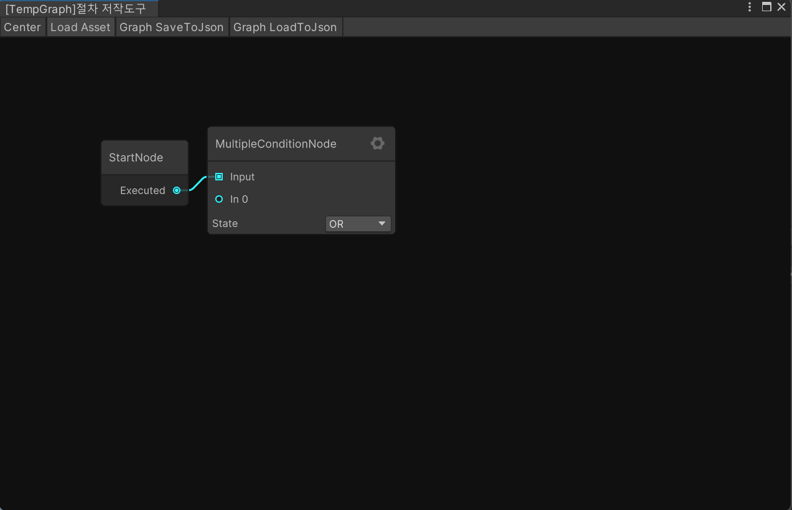

# UnityProcedureGraph

Node based procedure/flow graph editor & runtime runner for Unity.

---

## 0) 설명
UnityProcedureGraph는 [Node Graph Processor](https://github.com/alelievr/NodeGraphProcessor)를 기반으로 한 절차 그래프 제작 도구이자 런타임 실행 시스템입니다. 그래프를 JSON으로 저장하고 `UnityProcedureGraphManager`로 재생할 수 있습니다.

## 1) Features / 핵심 기능
- 노드 기반 절차/조건 그래프 생성
- `Tools/ProcessCreatorWindow` 메뉴로 에디터 호출
- 툴바에서 **Load Asset**, **Graph SaveToJson**, **Graph LoadToJson** 버튼 제공
- `UnityProcedureGraphManager`를 통한 그래프 런타임 실행 및 노드 변경 이벤트
- `GraphSerializable`로 그래프 ↔ JSON 직렬화
- `StartNode`, `MultipleConditionNode`, `StringListNode` 등 샘플 노드 포함
- [UniTask](https://github.com/Cysharp/UniTask)를 활용한 비동기 처리
- 커스텀 노드/뷰 확장 및 API 제공
---

## 2) Installation / 설치
1. **Unity 버전**: 2022.3.2f1 이상 권장.
2. **Git 클론**: 이 리포지토리를 그대로 프로젝트로 사용하거나 `Assets/000.Script`와 `Assets/Editor` 폴더를 복사합니다.
3. **의존성**
   - Node Graph Processor 1.3.0
   - UniTask 2.5.10

## 3) 이미지

